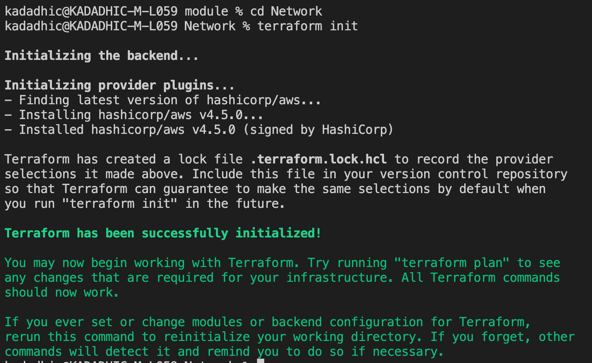
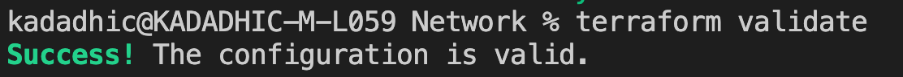
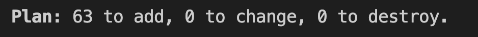
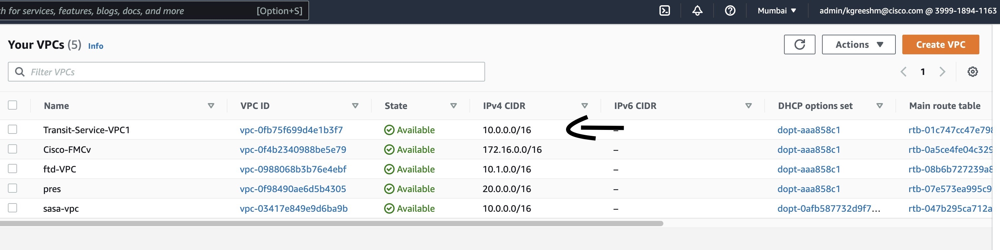
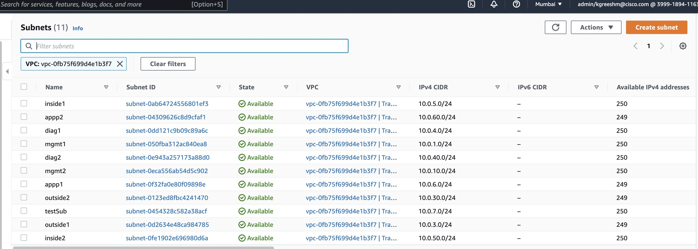
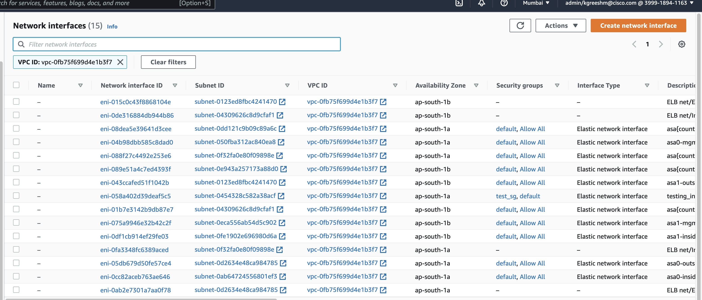
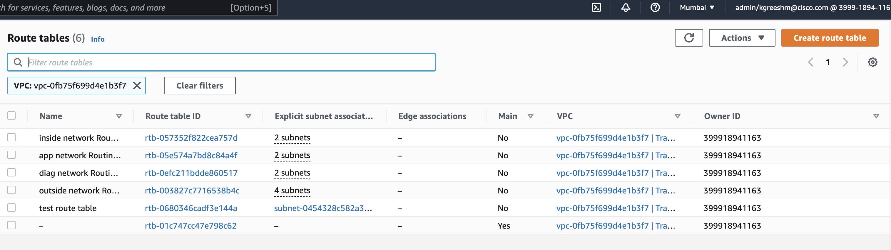

+++
title = "Network resources - Deployment"
chapter = false
weight = 2
+++

# **STEPS**
Aim is to deploy all the resources created on AWS through terraform. 

Open the Cloud9 terminal and navigate to the folder named **Deployment**
Ensure the following files are present in the folder.
- networks.tf
- providers.tf
- variables.tf
- terraform.tfvars
Ensure the followin folder is present in the folder
- modules

1. **<ins>Enter values for Terraform variables</ins>**
   - provide the 'aws_access_key' and 'aws_secret_key' of your user.
   - provide the name of the key created in previous section
   - Rest of the variables have been provided with a value already, however if you wish you can modify those values

And then run the following sets of command.
2. **<ins>terraform init</ins>**

   --Run ***terraform init***. This will download & install all the necessary packages needed, like the aws package. 

   

3. **<ins>terraform validate</ins>**

    --Run *terraform validate* to check for any syntax error in the code.

    

4. **<ins>terraform plan</ins>**

    --To understand what the code will reflect and do on your AWS account run *terraform plan --out awslab*, The resources shown with the '+' symbol are set to be created. It will show the number(may be different for your topology) of resources to be added.

    

5. **<ins>terrafrom apply</ins>**

    --If you are satisfied with the plan of the configuration, run *terraform apply awslab* to apply it.

    

Open your AWS Management Console to see if all the resources are correctly deployed. 

**VPC:** 

**Subnets:** 
Search for your VPC in subnets and see all of them.

**Interface:** 

**Route Tables:** 

