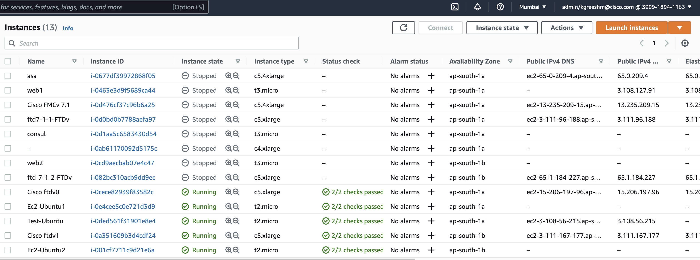

+++
title = "Deployment of FTD and FMC"
chapter = false
weight = 1
+++

# **Introduction** 

## <ins>**FMC**</ins>
The code below is for creating one FMC in any one of the AZ which will host the FTD instance. 

The data source to collect the ami of the FMC is: 
```
data "aws_ami" "fmcv" {
  owners      = ["aws-marketplace"]
 filter {
    name   = "name"
    values = ["${var.FMC_version}*"]
  }
  filter {
    name   = "product-code"
    values = ["bhx85r4r91ls2uwl69ajm9v1b"]
  }
  filter {
    name   = "virtualization-type"
    values = ["hvm"]
  }
}
```
<ins>**Creation of FMC**</ins>
```
resource "aws_instance" "fmcv" {
  ami                 = data.aws_ami.fmcv.id
  instance_type       = c5.4xlarge
  key_name            = var.keyname
    
  network_interface {
    network_interface_id = aws_network_interface.fmcmgmt.id
    device_index         = 0
  }
  user_data = data.template_file.fmc_startup_file.rendered
  tags = {
    Name = "Cisco FMCv"
  }
}
```
We pass the user data and the network interface specific to FMC. 
 
## <ins>**FTD</ins>**

The code below is deploying two FTD instances, each in a different availability zone with different network interfaces like *outside*, *inside*, *diagnostic* and *management* attached to it.
The data sources file to enable this particular configuration is as follows:
```
data "aws_ami" "ftdv" {
  most_recent = true
  owners      = ["aws-marketplace"]
  filter {
    name   = "name"
    values = ["ftdv-7.1.0"]
  }
  filter {
    name   = "product-code"
    values = ["<Enter-product-code>"]
  }
  filter {
    name   = "virtualization-type"
    values = ["hvm"]
  }
}
```
The above block is designed to fetch ami information of FTD w.r.t the given information in the filter attachment. We are filtering based on name, product-code and virtualization-type. ```most_recent``` is set to true so that in case of mulitiple images terraform can select the latest one. 
```
data "template_file" "ftd_startup_file" {
    count     = 2
    template  = file("${path.module}/ftd_startup_file.txt")
    vars = {
      fmc_ip       = var.fmc_mgmt_ip
      fmc_nat_id   = var.fmc_nat_id
      reg_key      = var.reg_key
    }
}
data "aws_availability_zones" "available" {}
```
Template file is used to fetch the *"user data"* that is needed at the time of FTD creation. ```aws_availability_zones``` is used to get list of all the AZ in a region.

**<ins>Creation of FTD instance </ins>** 

```
resource "aws_instance" "ftdv" {
  count               = 2
  ami                 = data.aws_ami.ftdv.id
  instance_type       = var.ftd_size
  key_name            = var.keyname

  network_interface {
    network_interface_id = element(var.ftd_mgmt_interface,count.index)
    device_index         = 0
  }
  network_interface {
    network_interface_id = element(var.ftd_diag_interface,count.index)
    device_index         = 1
  }
  network_interface {
    network_interface_id = element(var.ftd_outside_interface,count.index)
    device_index         = 2
  }
  network_interface {
    network_interface_id = element(var.ftd_inside_interface,count.index)
    device_index         = 3
  }
  user_data = data.template_file.ftd_startup_file[count.index].rendered

  tags ={
    Name = "Cisco ftdv${count.index}"
  }
}
```  
    

To attach various network interfaces we simply pass that network interface's ID, with a device index. User data is also provided here.
>Note: Device index of each NIC must be different.
