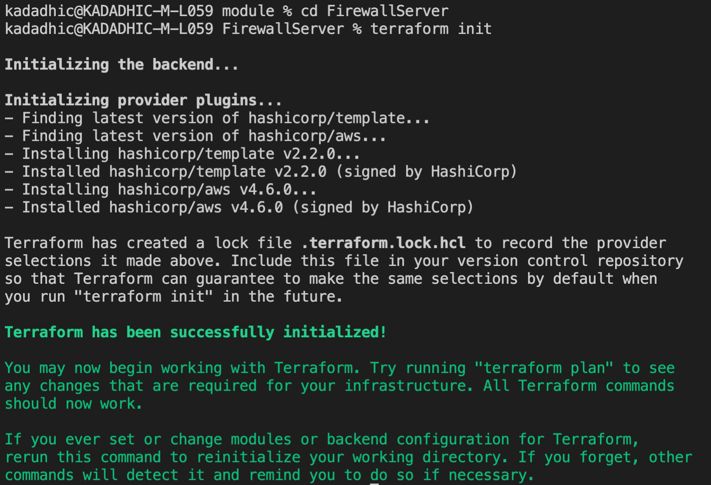
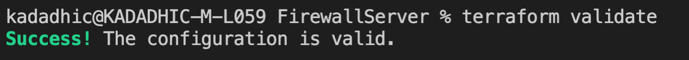
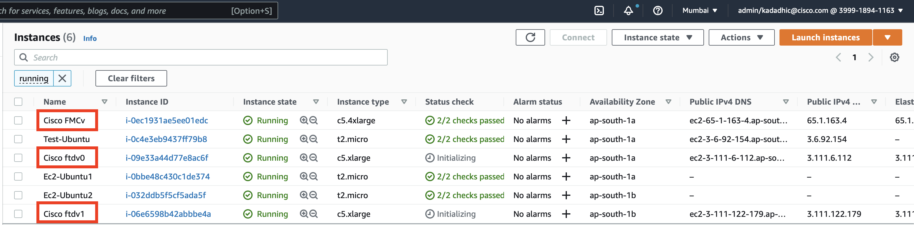
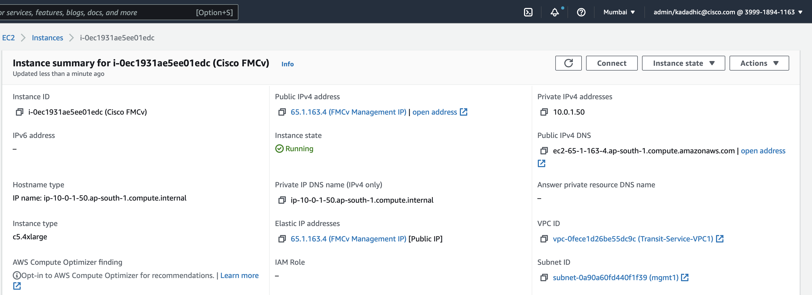
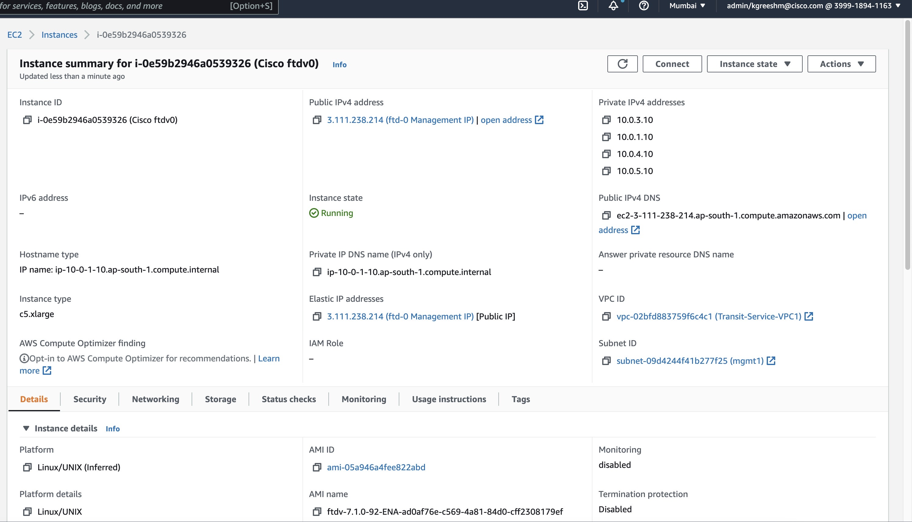

+++
title = "FTD and FMC - Deployment"
chapter = false
weight = 2
+++

# STEPS
Aim is to deploy all the instances on AWS through terraform. 

Open a *terminal* in folder which contains the .tf file of the firewall configuration.

>Note: We have ```2``` FTD, ```1``` FMC & ```2``` Application server deployed here

And then run the following sets of command.
1. **<ins>terraform init**</ins>
   
   -- cd into the folder 
  
   --Run *terraform init*. This will download & install all the necessary packages needed, like the aws package. 

   
2. **<ins>terraform validate**</ins>

    --Run *terraform validate* to check for any syntax error in the code.

    
3. **<ins>terraform plan**</ins>

    --To understand what the code will reflect and do on your AWS account run *terraform plan*, The resources shown with the '+' symbol are set to be created. It will show the number of resources to be added.

    

4. **<ins>terrafrom apply**</ins>

    --If you are satisfied with the plan of the configuration, run *terraform apply* to apply it.

Open your AWS Management Console to see if all the resources are correctly deployed. 

**EC2:**

--FMC and both the FTD are highlighted. 


**FMC:** 

--Open the FMC instance to see the public IP and other details of FMC.


**FTD:**

-- FTD can also be expanded in the similar fashion


5. **<ins>terrafrom destroy</ins>**

     --Run *terraform destroy* to terminate and delete all the components created.


