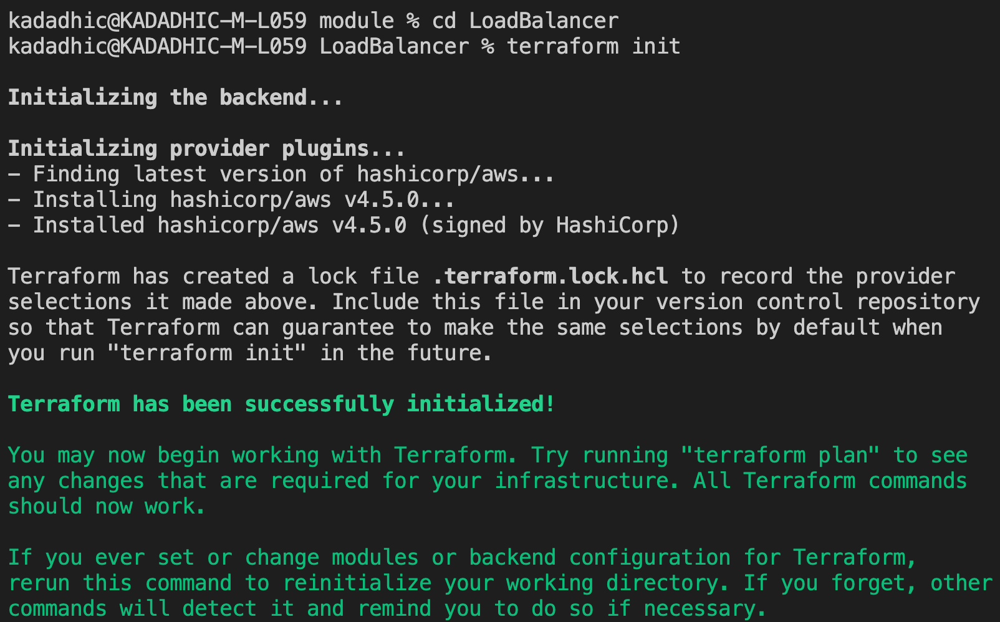

# Deployment of the Load Balancer.
Aim is to deploy the Load balancer on AWS through terraform. 

Open a *terminal* in folder which contains the .tf file of the load balancer configuration.

And then run the following sets of command.
1. **<ins>terraform init**</ins>
   -- cd into the folder 
   --Run *terraform init*. This will download & install all the necessary packages needed, like the aws package. 

   
2. **<ins>terraform validate**</ins>

    --Run *terraform validate* to check for any syntax error in the code.

    
3. **<ins>terraform plan**</ins>

    --To understand what the code will reflect and do on your AWS account run *terraform plan*, The resources shown with the '+' symbol are set to be created. It will show the number of resources to be added.

    

4. **<ins>terrafrom apply**</ins>

    --If you are satisfied with the plan of the configuration, run *terraform apply* to apply it.

Open your AWS Management Console to see if all the resources are correctly deployed. 

**Load Balancer:** 

You can click on any one to see detailed info like this:

**Target Groups:**

5. **<ins>terrafrom destroy</ins>**
    
    --Run *terraform destroy* to terminate and delete all the components created.

