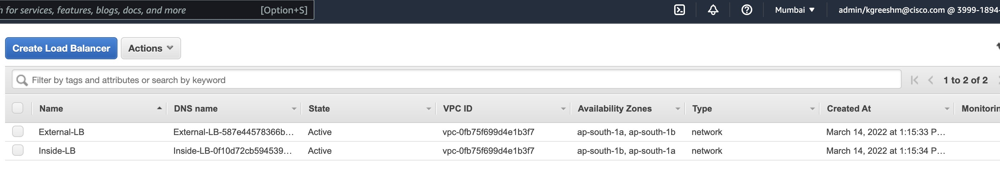
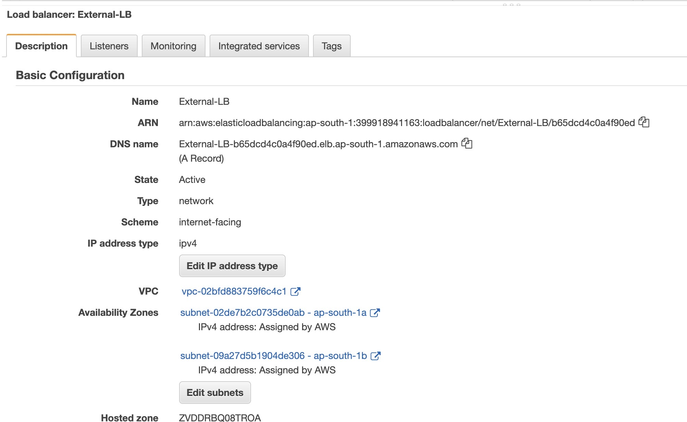
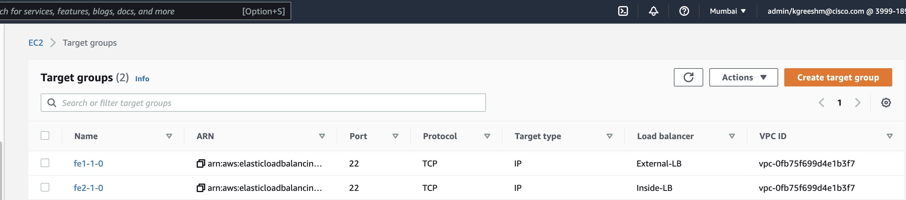

+++
title = "Load Balancer - Deployment"
chapter = false
weight = 2
+++

# Deployment of the Load Balancer.
Aim is to deploy the Load balancer on AWS through terraform. 

Navigate to the Cloud9 terminal and copy **loadbalancers.tf** file from the Deployment_resources folder to the Deployment folder.

```
  cp ./Deployment_resources/loadbalancers.tf ./Deployment/loadbalancers.tf
  cd ./Deployment
``` 

And then run the following set of commands.

1. **<ins>terraform validate**</ins>

    --Run *terraform validate* to check for any syntax error in the code.

    

2. **<ins>terraform plan**</ins>

    --To understand what the code will reflect and do on your AWS account run *terraform plan --out awslab*, The resources shown with the '+' symbol are set to be created. It will show the number of additional resources to be added.

    

3. **<ins>terrafrom apply**</ins>

    --If you are satisfied with the plan of the configuration, run *terraform apply* to apply it.

Open your AWS Management Console to see if all the resources are correctly deployed. 

**Load Balancer:** 


You can click on any one to see detailed info like this:

**Target Groups:**


