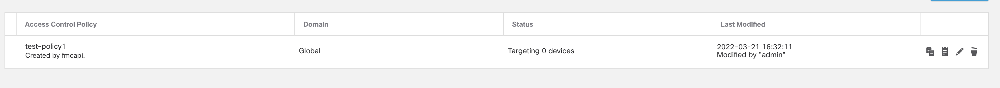

# **Configuring the Firewall**

Firewall Management Center (FMC) needs to be configured to make sure that your firewall performs as expected.

In the FMC we will be creating/adding:  

1. Access control policy - **```1```**.
2. Security zones - **```2```**. (inside & outside)
3. Network & Host objects like LB & Gateway - **```1```** each.
4. NAT rules.
5. Adding FTD as a device- **```1```**. 
6. Creating routes. 
7. Association of ACP and NAT with our FTD

>Note:For the purpose of demonstration the code below is written to add only one FTD and its subsequent entities. The same method can be used to support multiple FTDs 

There are two ways to set up an FMC:

* Using FMC UI
* Using python script with [fmcpi](https://github.com/marksull/fmcapi)

We are using python script.

Code is as follows: 
 ### <ins>**Step 0:  Importing the packages & tapping in FMC** </ins>

```python
import fmcapi
import logging
from pathlib import Path
import argparse
import time
```
Install fmcapi with command ```pip3 install fmcapi```

```python
def main():
    with fmcapi.FMC(
        host=fmc_host_ip, 
        username=fmc_host_username,
        password=fmc_host_password, 
        autodeploy=False,
        file_logging='test.txt') as fmc:
```
This creates an instance of FMC class, we need to provide the *public ip, username, password*  of FMC.
Logs can be also be maintained in a .txt file by passing it as an argument. 
> NOTE: The whole code from this point is also inside the class **main()** and on the same identation level.

 ### <ins>**Step 1: Creating Access Control Policy** </ins>
```python
acp = fmcapi.AccessPolicies(fmc=fmc, name= policy_name)
        acp.defaultAction = "BLOCK"
        acp.post()
```
```fmcapi.AccessPolicies``` is used to create an ACP, pass the FMC instance and the name of policy to deploy it.  
Choose the default action that ACP must take out of *Block all traffic, Intrusion Prevention & Network Discovery.*
Writing ```acp.post()``` deploys this configuration

### <ins> **Step 2: Adding Security Zones** </ins>

```python
sz_inside = fmcapi.SecurityZones(fmc=fmc, name="inside3", interfaceMode="ROUTED")
sz_inside.post()
sz_outside = fmcapi.SecurityZones(fmc=fmc, name="outside3", interfaceMode="ROUTED")
sz_outside.post()
```

Use ```fmcapi.SecurityZones``` to create two(or more) security zones. **Inside** and **Outside** SZs are created here with their interface mode set to *routed*.

### <ins>**Step 3: Adding Hosts & Network Objects**</ins>

We are adding an Internet Gateway, Loadbalancer for our webserver and the network object of the webserver. 

```python
#Gateway Host Object
hq_dfgw_gateway = fmcapi.Hosts(fmc=fmc, name="hq-default-gateway", value=igw_ip)
hq_dfgw_gateway.post()
        
#Web Server 1 Network Object
hq_web1 = fmcapi.Networks(fmc=fmc, name="hq-web",value=app_cidr)
hq_web1.post()
        
#ELB Network Object
hq_elb = fmcapi.Hosts(fmc=fmc, name="hq-elb", value=elb_ip)
hq_elb.post()
```
* Provide an IP address for Internet Gateway .
* Choose the CIDR which is used by your web server.
* Add the IP address of the loadbalancer attached to the web server here. The IP address added must resonate with the CIDR of the webserver.
>Note: IP address of loadbalancer can be found in the *network interface* attached to tha load balancer.

### <ins>**Step 4: Creating ACP rules**</ins>

The code below creates a rule to allows all outside traffic to the webserver.

ACP rules is a subset of ACP.

```python
hq_acprule = fmcapi.AccessRules(fmc=fmc,acp_name=acp.name,name="To Web Server",action="ALLOW",enabled=True)
hq_acprule.source_zone(action="add", name=sz_outside.name)
hq_acprule.destination_zone(action="add", name=sz_inside.name)hq_acprule.destination_network(action="add", name=hq_elb.name) hq_acprule.logEnd = False
hq_acprule.post()
```
Using ```fmcapi.AccessRules``` we add source & destination zones and the destination network to make up the rule. 

We provide the name of security zones and name of the Load Balancer where needed, set *action=add* to add the respective fields.

>Note: Argument ```hq_acprule.source_network``` can also be used if needed.

### <ins>**Step 5: Adding Static NAT**</ins>

```python
nat = fmcapi.FTDNatPolicies(fmc=fmc, name="NAT Policy")
nat.post()

#NAT Rule
manualnat = fmcapi.ManualNatRules(fmc=fmc)
manualnat.natType = "STATIC"
manualnat.original_source(hq_elb.name)
manualnat.original_destination_port("HTTP")
manualnat.translated_destination_port("HTTP")
manualnat.translated_destination(hq_web1.name)
manualnat.interfaceInOriginalDestination = True
manualnat.interfaceInTranslatedSource = True
manualnat.source_intf(name=sz_outside.name)
manualnat.destination_intf(name=sz_inside.name)
manualnat.nat_policy(name=nat.name)
manualnat.enabled = True
manualnat.post()
```

NAT type here is static, dynamic type can also be used based on the network topology. Set the source to *load balancer* & provide the name of your security zones in source and destination fields.

### <ins>**Step 6: Adding FTD as a device**</ins>

```python
hq_ftd = fmcapi.DeviceRecords(fmc=fmc)
hq_ftd.hostName = ftd_hostname
hq_ftd.regKey = ftd_regKey
hq_ftd.acp(name=policy_name)
hq_ftd.name = ftd_name
hq_ftd.licensing(action="add", name="BASE")
hq_ftd.post(post_wait_time=300)
```
1. Provide the IP address of your deployed FTD for hostName field. Can be found in the AWS EC2 console.
2. Provide the same registration key used to create the FTD, make sure that this key must not have any special characters apart from '-'. 
3. Attach the ACP to the FTD .
4. ```post_wait_time``` takes values in seconds and will wait for that amount of time until the FTD is added.  

For interfaces of FTD the code snippet will be:
```
hq_ftd_g00 = fmcapi.PhysicalInterfaces(fmc=fmc, device_name=hq_ftd.name)
hq_ftd_g00.get(name="GigabitEthernet0/0")
hq_ftd_g00.enabled = True
hq_ftd_g00.ifname = "inside"
hq_ftd_g00.dhcp(False, 1)
hq_ftd_g00.sz(name="inside")
hq_ftd_g00.put()

hq_ftd_g01 = fmcapi.PhysicalInterfaces(fmc=fmc, device_name=hq_ftd.name)
hq_ftd_g01.get(name="GigabitEthernet0/1")
hq_ftd_g01.enabled = True
hq_ftd_g01.ifname = "outside"
hq_ftd_g01.dhcp(True, 1)
hq_ftd_g01.sz(name="outside")
hq_ftd_g01.put()
```
We are setting DHCP true in case of outside and false in the case of inside SZ. Names  ```GigabitEthernet0/0``` & ```GigabitEthernet0/1``` are the name of physcial interfaces which are being configured here. 

### <ins>**Step 7: Adding routes for FTD and Webserver**</ins>

Adding a static default route for FTD-
```python
hq_default_route = fmcapi.IPv4StaticRoutes(fmc=fmc, name="hq_default_route")
hq_default_route.device(device_name=hq_ftd.name)
hq_default_route.networks(action="add", networks=["any-ipv4"])
hq_default_route.gw(name=hq_dfgw_gateway.name)
hq_default_route.interfaceName = hq_ftd_g01.ifname
hq_default_route.metricValue = 1
hq_default_route.post()
```
All static routes can be created using ```fmcapi.IPv4StaticRoutes```.  
1. Pass the value of FTD device name. 
2. Set the network as "any-ipv4" and add the name of your Gateway.
3. Provide the value of outside interface & post the configuration.
   
We also need to  create a route for webserver in the similar fashion.

```python
hq_web_route = fmcapi.IPv4StaticRoutes(fmc=fmc, name="hq_web_route")
hq_web_route.device(device_name=hq_ftd.name)
hq_default_route.networks(action="add", networks=["hq-web1"])
hq_default_route.gw(name=hq_elb.name)
hq_default_route.interfaceName = hq_ftd_g00.ifname
hq_default_route.metricValue = 1
hq_default_route.post()
```
One thing to note is that here in the value of ```default_route_gw```  we provide the name of the loadbalancer associated with web server instead of the Gateway of our topology.

### <ins>**Step 8: Associate NAT policy with FTD.**</ins>

```python
devices = [{"name": hq_ftd.name, "type": "device"}]
assign_nat_policy = fmcapi.PolicyAssignments(fmc=fmc)
assign_nat_policy.ftd_natpolicy(name=nat.name, devices=devices)
assign_nat_policy.post()
```

Use ```fmcapi.PolicyAssignments``` and pass the name of FTD and NAT Policy to connect them together.

### <ins>**Final step: Running the Script**</ins>

Open the terminal and *cd* into the folder which has your python script in it.

Run the file by typing the command. 

```
python3 <filename>.py
```
(Ensure that you have python 3 installed on your system)


In the terminal itself you would be able to see all the successful tasks and errors (if any). 

To ensure that everything took place as per your requirment open the FMC-UI on your browser and check things there. 

For eg: 

**ACP:**
 

It also shows that this was created using fmcapi

**Devices:**


Check the policy name attached to the FTD.

