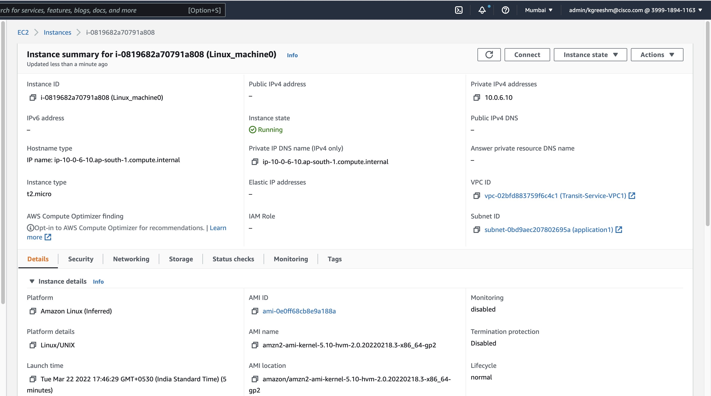

# **Deployment of Test Machines**

To test the network topology we need to create 2 application server in different AZs and different subnet. Also one test machine should be deployed in a separate subnet  which has a public IP for the purpose of Internet connectivity.

<ins>**Deploying two application server</ins> :** 

```
resource "aws_instance" "Application_server" {
  count         = 2
  ami           = "ami-0851b76e8b1bce90b" 
  instance_type = "t2.micro"
  
  network_interface {
    network_interface_id = element(aws_network_interface.app_interface[*].id,count.index)
    device_index         = 0
  }

  tags = {
    Name = "Linux_machine${count.index+1}"
  }
}
```
>Note: Both application server are in different AZ & in their own dedicated subnet with respective network inrterfaces attached to them.  

After its deployment go to the AWS Console and check the instance is AWS Console.


You can further expand the machine to see details specefic to it.



